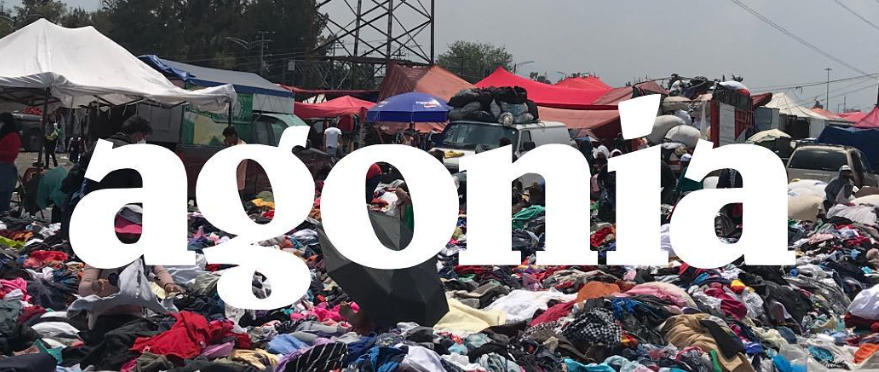
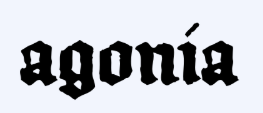
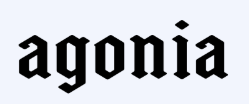
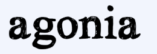
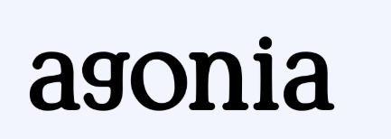
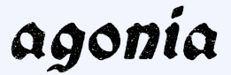
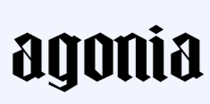
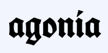

<!-- this is to export markdown to pdf without outline -->

# _agonía_

## 1. Misión, visión y valores

### Misón

En _agonía_, nuestra misión es fusionar la energía de la cultura urbana con la pasión por la escalada y los deportes no populares, mientras reflejamos las realidades y luchas de nuestra cominidad (Mexico - América Latina). Diseñamos ropa auténtica que no solo celebra la creatividad contracultural, sino que también reconoce el contexto de desigualdad, inseguridad y resiliencia que define nuestra región. Lo hacemos conscientes de las contradicciones que implica fabricar más ropa en un mundo saturado de consumo y desigualdad.

Entendemos que nuestras prendas no cambiarán el mundo, ni pretenden hacerlo. Lo que ofrecemos es una forma de reflexión: una invitación a cuestionar, a ser críticos con lo que consumimos y cómo actuamos en nuestro entorno. Creemos en el poder de la comunidad para transformar, no solo en el deporte, sino también en la forma en que nos enfrentamos a los retos sociales y medioambientales de nuestra época.

Con crítica y autoconciencia, buscamos promover la reutilización y el consumo consciente, mientras destacamos historias de atletas emergentes y sus esfuerzos por superar las barreras estructurales. Cada prenda que creamos lleva el espíritu de superación, la lucha diaria y el estilo único que nos caracteriza como latinos.

En _agonía_, cada prenda lleva consigo una verdad: somos parte del problema que criticamos, pero también una herramienta para conectarnos, compartir historias de resiliencia para crecer y construir comunidad.

### Visión

Ser una plataforma que dé visibilidad a las historias y luchas de atletas mexicanos. En _agonía_, nuestra visión no es otra fantasía de cambiar el mundo, sino crear un espacio donde los deportes no convencionales encuentren un lugar real, accesible e inclusivo. Queremos que nuestras prendas sean algo más que ropa: un recordatorio silencioso de resistencia, creatividad y las transformaciones posibles, aunque no siempre inmediatas.

Vivimos en un mundo donde ciertos deportes reciben atención excesiva, alimentados por un ciclo interminable de consumo y espectáculo. En _agonía_, queremos romper con esa narrativa, ofreciendo una plataforma que valore y visibilice el esfuerzo genuino de los atletas mexicanos que, a pesar de las barreras, continúan luchando por sus sueños. No buscamos liderar movimientos utópicos, pero sí queremos inspirar a quienes desafían las normas, enfrentan barreras y construyen, con esfuerzo individual y colectivo, un mundo que valore más las historias de lucha que los logros superficiales.

### Valores

1. Autenticidad: Cada diseño y acción refleja nuestra conexión con las
   realidades sociales y culturales de nuestra comunidad.
2. Resiliencia: Honramos la lucha diaria que define a las personas y comunidades
   en América Latina, y promovemos superar barreras con esfuerzo y creatividad.
3. Conciencia social y ambiental: Criticamos las dinámicas del consumo
   desmedido, impulsando prácticas que favorezcan la reutilización y la
   sostenibilidad.
4. Inclusión: Creemos que el deporte y la comunidad son para todos,
   independientemente de su origen, contexto o nivel.
5. Creatividad contracultural: Celebramos la innovación y la rebeldía frente a
   las normas establecidas, generando nuevas formas de expresión y conexión.
6. Contra corriente: Nos definimos por ir en contra de las tendencias
   convencionales y los caminos fáciles, abrazando la incomodidad y los desafíos
   como una forma de avanzar hacia lo genuino.
7. Comunidad: Impulsamos la conexión genuina entre personas, creando espacios
   donde las historias y logros de todos sean valorados y compartidos.

## 2. Breve texto explicando la personalidad de tu marca

_agonía_ es una marca que no teme cuestionar lo establecido, llevando consigo el espíritu de lucha y rebeldía que define a las comunidades latinoamericanas. Habla desde una perspectiva crítica y autoconciente, evitando los discursos vacíos de optimismo que ignoran las realidades del entorno.

Es una marca que celebra las imperfecciones, las caídas y los desafíos como parte esencial del proceso de superación. Reconoce que el camino no es sencillo y que las victorias, aunque pequeñas, llevan consigo un peso significativo. Con un toque contracultural y una conexión emocional real, _agonía_ es cercana y honesta, evitando caer en idealismos. Es una invitación a ser auténtico, a abrazar las contradicciones y a encontrar en ellas una forma de expresión y pertenencia.

## 3. ¿Hay palabras recurrentes en tu comunicación?

- Contra corriente
- Disidente
- Resiliente
- Comunitario
- Inclusivo
- Consciente
- Latino
- Auténtico
- Contracultural
- Lucha diaria
- Superación
- Voz propia
- Inconformista
- Transformación

## 4. ¿Cómo te gustaría que te perciban tus clientes?

_agonía_, una marca como cualquier otra. No hay mucho que podamos decir para disfrazar el hecho de que estamos aquí para venderte ropa. Claro, nos gusta pensar que somos diferentes, que cuestionamos las normas y representamos algo más grande, pero al final del día, seguimos siendo parte del mismo ciclo que todos pretendemos criticar.

Una marca que cuestiona las normas establecidas y se posiciona como disidente frente al status quo, promoviendo un espíritu de lucha y resistencia.Aspiramos a ser reconocidos como un movimiento que apoya a talentos no aprovechados, especialmente en deportes no convencionales, y que trabaja para visibilizar sus historias y luchas. Nuestra esencia está en construir una comunidad inclusiva, resiliente y consciente.

**Si decides comprar algo, no esperes que tu vida cambie. Es solo una camiseta que simpatiza con estas ideas y con nuestra estetica.**

## 5. ¿Tienes un logotipo?

Actualmente hay logo, es una imitacion del logo de patagonía pero queremos tener nuestro toque autentico.

## 6. ¿Tienes preferencias de tipografías?

[FF Brokenscript Rough Std Condensed Bold](https://www.myfonts.com/es/products/std-condensed-bold-ff-brokenscript-rough-367889?queryId=4190b8d240a4a8938d2d46945a717a7a&index=universal_search_data&objectIDs=5833809000)

[Byzantus](https://www.myfonts.com/es/products/regular-byzantus-24938?queryId=4190b8d240a4a8938d2d46945a717a7a&index=universal_search_data&objectIDs=5389729002)

[Hand Scribble Sketch Times INvert](https://www.myfonts.com/es/products/invert-hand-scribble-sketch-times-421133?queryId=37e175af5db7383f11363291e9c3d171&index=universal_search_data&objectIDs=5471826002)

[Berryfield Regular](https://www.myfonts.com/es/products/regular-berryfield-1409?queryId=37e175af5db7383f11363291e9c3d171&index=universal_search_data&objectIDs=5370184002)

[Vinque Antique Bold Italic](https://www.myfonts.com/es/products/bold-italic-vinque-antique-249577?queryId=7238b73a2e84b2fe40a7c4239349d6c1&index=universal_search_data&objectIDs=8618010001)

[Blackiron Regular](https://www.myfonts.com/es/products/regular-blackiron-479792?queryId=7238b73a2e84b2fe40a7c4239349d6c1&index=universal_search_data&objectIDs=5499441002)

[Fette Deutsche Schrift](https://www.myfonts.com/es/products/regular-fette-deutsche-schrift-318433?queryId=7238b73a2e84b2fe40a7c4239349d6c1&index=universal_search_data&objectIDs=8658172001)

## 7. ¿Tienes referencias visuales de marcas que te guste su imagen?

### Antigrav

[Instagram](https://www.antigrav.wtf/)
[Website](https://www.instagram.com/antigrav.wtf/)

### Mellow

[Instagram](https://mellowclimbing.com/)
[Website](https://www.instagram.com/mellowclimbing/)

### Pusher

[Instagram](https://pusher.world/)
[Website](https://www.instagram.com/pusherholds/)
