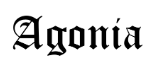
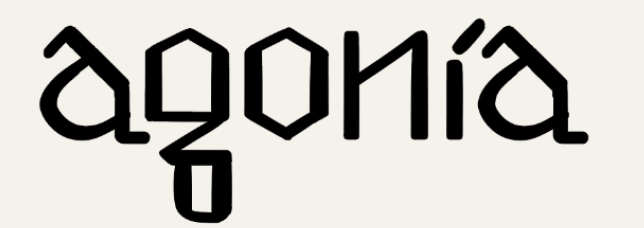
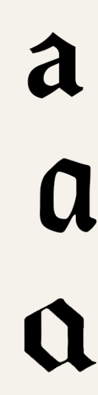
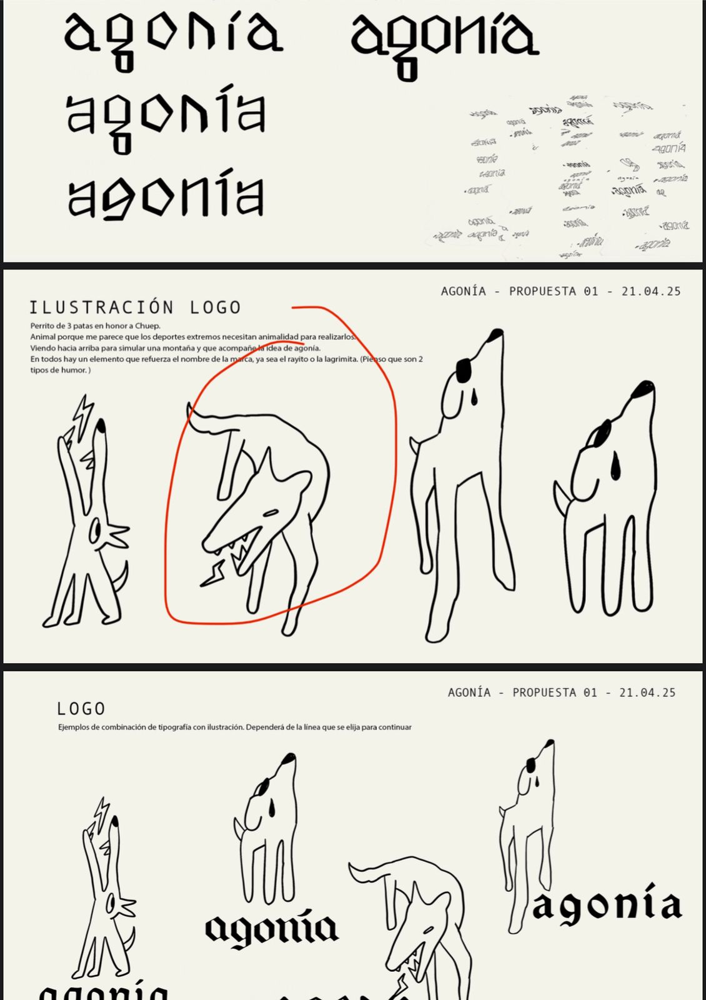
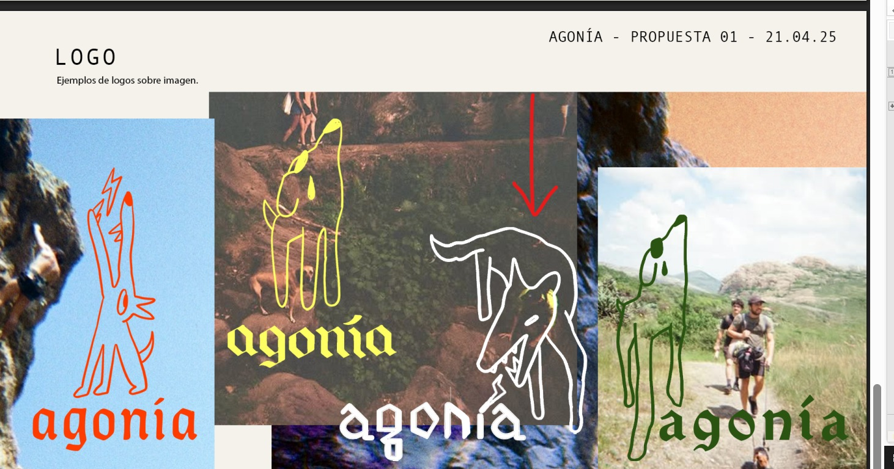
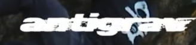
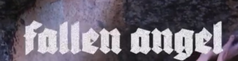
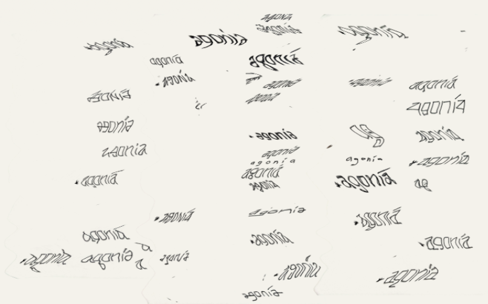
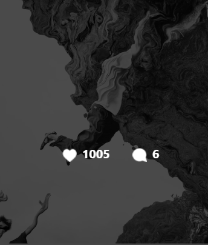

## Existentes

Sobre las tipografías existentes, me gustaría mucho adquirirlas, no para el logo, sino para cuando haga videos o publicaciones. Gracias por encontrar las tipografías accesibles.

También encontré otras tipografías que me gustaron y que, en el futuro, me gustaría adquirir:
[Monotype Old English Text Std](https://www.myfonts.com/es/products/old-english-text-old-english-text-342430?queryId=907eefb1d56524f0b8e9fb1dc2b79b3d&index=universal_search_data&objectIDs=5824660000)

[Cloister Black Std Regular](https://www.myfonts.com/es/products/cloister-black-cloister-black-434190?queryId=907eefb1d56524f0b8e9fb1dc2b79b3d&index=universal_search_data&objectIDs=5468779002)

---

## A mano

Me encantaron todas, jaja. Pero para definir mejor la del logo, me gusta esta:

En particular, la **G** y la **N** me encantaron, me parecieron hermosas. Se podria hacer una versión donde la "a" fuera más como las tipografías de referencia?

---

## Ilustración del logo

Me gustaron todos, jaja, no podría escoger solo uno. Creo que ya definí que el logo principal será la tipografía, y que estos diseños sean más secundarios, que aparezcan en diferentes elementos, como lo planteaste en el último slide. Eso me gustó mucho, o incluso para el diseño de una playera (por ejemplo, en la etiqueta de la manga). Pero que lo principal sea la tipografía.

Este fue mi favorito (aunque también me veo usando los otros):

Por último, me gustó mucho lo que mencionaste sobre las texturas irregulares y las líneas algo descuidadas o trashy con textura. Esto de la textura y los efectos chance no lo digo para el logo sino para tenerlo en cuenta:

También me gusta ese **efecto distorsionado**, como si fuera agua:

